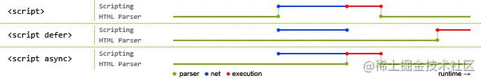

# 基础

## 前端页面组成哪三部分，作用

* 结构层 HTML HTML实现页面结构
* 表示层 CSS  CSS完成页面的表现与风格
* 行为层 JavaScript JavaScript实现一些客户端的功能与业务。

## H5标签头

* <! DOCTYPE html>

## h5新特性

* 语义化标签
* 新表单类型
* 视频和音频标签
* canvas绘图
* SVG矢量图形
* web存储（localstorage,sessionstorage）

## src和href的区别

* **src**：表示对资源的引用，指向内容会嵌入当前标签所在的位置。src会将其资源下载并应用到文档内，如js脚本。当浏览器解析到该元素时，会暂停其他资源的下载和处理，直至该资源的加载编译执行完成，所以一般js脚本会放到页面底部
* **href**：表示超文本得引用，指向一些网络资源，建立当前元素链接关系。当浏览器识别到指向文件，就会进行下载资源，不会停止对当前文档得处理。常用于a、link标签上。

## 语义化理解

语义化是指内容结构化（内容语义化），选择合适得标签（代码语义化）。

语义化优点：

* 利于SEO，适合搜索引擎得爬虫爬取有效信息。
* 利于开发者，增加可读性，结构更加清晰，利于开发维护。

``` 

<header></header>  头部

<nav></nav>  导航栏

<section></section>  区块（有语义化的div）

<main></main>  主要区域

<article></article>  主要内容

<aside></aside>  侧边栏

<footer></footer>  底部
```

## DOCTYPE(文档类型)的作用

DOCTYPE是html5中一种标准通用标记语言的文档类型声明，目的是告诉浏览器（解析器）应该以什么样（html或xhtml）的文档类型定义来解析文档，不同的渲染模式会影响浏览器对CSS代码甚至JavaScript脚本的解析。它必须声明在HTML文档的第一行。

类型有： 

* HTML5 

``` 

<!DOCTYPE>
```

* HMTL4 

``` 

<! DOCTYPE HTML PUBLIC "-//W3C//DTD HTML 4.01//EN" "http://www.w3.org/TR/html4/strict.dtd">
```

## script async和defer

如果没有defer或者async属性，浏览器会立即加载并执行相应的脚本。它不会等待后续的文档元素，读取到就会开始加载和执行，阻塞了后续温带的加载

### 其中蓝色代表js脚本网络加载时间，红色代表js脚本执行时间，绿色代表html解析。



* 执行顺序：多个async属性的标签不保证加载顺序；，多个带defer属性，按加载顺序执行
* 脚本是否并行执行： async属性，表示后续文档的加载和执行与脚本的加载和执行是并行进行的，即异步执行；defer属性，加载后续文档的过程和js脚本的加载（此时加载不执行）是并行进行的，js脚本需要等待文档素有元素解析完成后才执行，DOMContentLoaded事件触发执行之前。


## <code>meta</code>标签
由<code>name</code>和<code>content</code>构成， 描述网页属性，如作者描述关键词等

## 